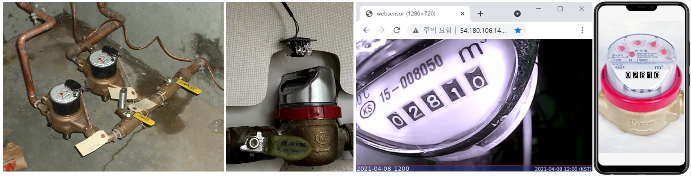

{"type":"level","id":"1","description":"수도계량기의 숫자 표시부를 읽어서 실시간 모니터링 하는 사물인터넷 스타트업을 위한 프로젝트"}

## 과제목표
수도 계량기 숫자 읽어서 웹서버에 실시간 디지탈트윈 기능, 실시간 분석 및 액튜에이션 확장기능 개발

## 배경
IoT 전문회사인 MeasureWare사의 기반서비스는 현장에 설치되어 사용중인 Legacy 계량기(통신기능등 부재)의 미터값을 실시간으로 읽어서 디지탈화하여 디지탈트윈 형태로 형상화 하는 것을 기반으로 실시간 감시, 실시간 액튜에이션, 리스크 관리 등 다양한 고객맞춤형 서비스를 제공하는 회사이다. 이 회사는 관리대상 미터에 카메라를 부착하여 HTTP를 통해 1시간 간격의 실시간 이미지를 가져오는 기능을 구현하였고 대상을 확대하고 있다.

http://bit.ly/websensor1

http://bit.ly/webmeter1

## 보유하고 있어야 할 badge
* Python

## 획득 Badge
* OpenCV
* Flask 혹은 django Web Framework
* Tensorflow 패션 MNIST 수준의 머신러닝 프로그램
* Numpy array shape
* Numpy ndarray 
 
## List of Missions
* Mission1: 숫자가 표시되는 계량기의 숫자표시부의 image를 읽어들여서 읽어들이고자 하는 숫자부분의 이미지를 추출한다. 다음의 과정들을 사용한다.
    1. 회전  2. 광각뷰 보정  3. crop  4. gray scale로 변환, 숫자부문 추출한 이미지 출력.
* Mission2: Mission1의 이미지를 낱자 단위로 분리하고, 구글 API를 이용하여 문자인식하여 출력한다.
* Mission3: 주어진 수도계량이 이미지화일을 다운로드 받아 Tensorflow의 Fashion MNIST 알고리듬을 적용을 위한 Labelled 데이타셋을 만든다.
* Mission4: Mission 3에서 만든 데이타셋으로 Fashion MNIST 알고리듬을 이용 training을 시키고 숫자인식 시스템을 완성한다.
* Remarks: Human-Friendly형태로 구성한 이 형태는 간단한 Preprocessing을 통해 Computer-Friendly JSON으로 변환한다.  한줄은 ':'으로 구분되어 ':' 앞부분은 black제거후 Key로, ':' 뒷부분은 Value로 변환한다
