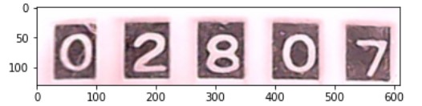

{"type":"mission","id":"1","description":"이미지로부터 인식대상 숫자부분을 추출"}

## 수도계량기 이미지로부터 인식대상 숫자부분을 추출해낸다.


이미지를 회전시키고 왜곡을 보정하는 등의 과정 및 인식하고자 하는 부분을 식별해 낸다.

### 1. 이미지획득
첫단계에서 웹서버에 저장해둔 image를 URL을 통해 가져온다. 직접 연결된 카메라에서 캡처하거나 화일에서 가져와도 된다.
```
resp = requests.get(url)
image = np.asarray(bytearray(resp.content), dtype="uint8")
image = cv2.imdecode(image, cv2.IMREAD_COLOR)
```


requests 패키지의 content API는 결과값을 binary로 받을때 사용한다. image format을 IMREAD_COLOR로 지정하여 마치 보통의 칼라 JPG화일을 읽은것과 동일한 상태로 두고 시작한다.

### 2. 이미지 회전
이미지의 원하는 데이타를 수평으로 만들기위해 적절한 중심점과 회전각을 찾아 다음과 같은 방식으로 API을 이용하여 회전시킨다.
```
M = cv2.getRotationMatrix2D((130, 400), -27, 1.0)
img2 = cv2.warpAffine(img, M, (1280, 720))
```


Affine Transformation은 선의 평행성을 유지하는 이미지 변환작업을 수행한다.

### 3. 이미지의 원근효과 제거
이미지의 4점을 선택하여 이동시킬 좌표를 지정하는 방식으로 Presepective(원근법) 변환을 통해 추출대상 이미지를 최대한 정면에서 바라본 직사각형 형태로 만든다.
```
pts1 = np.float32([[138,432],[167,521],[708,407],[709,517]])
pts2 = np.float32([[140,430],[140,520],[706,430],[706,520]])
M = cv2.getPerspectiveTransform(pts1, pts2)
img3 = cv2.warpPerspective(img2, M, (1280, 728))
```


Persepective Transformation은 이미지에 반영된 원근법 효과를 제거하여 대상이미지를 정면에서 바라보는 형태로 만들기위한 목적으로 사용한다.

### 4. 숫자부분 추출
계량기 숫자 부분을 직사각형으로 포함하는 영역을 지정하여 인식 대상 영역을 최대한 좁혀서 추출한다.
```
img4 = img3[406:536,120:730]
```


우선, 숫자부분의 이미지를 추출한다. 정확히 숫자의 경계를 추출하는 것은 추가 프로그램을 통하고, 우선은 문제의 난이도를 줄이기위해 숫자부분에 약간의 테두리를 가진 정도로 범위를 좁힌다. 

## 검색을 위한 키워드
opencv, imread, warpAffine, warpPersepective
