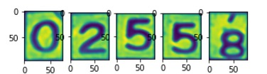

{"type":"mission","id":"2","description":"숫자 추출 프로그램", "temper":"good"}
## 숫자부분 전체 혹은 숫자 낱자를 추출해내는 프로그램 구성

5자리 전체, 혹은 개별 낱자를 추출해서 머신러닝 API를 사용할 수 있도록 전단계의 작업을 진행한다.

## 검색을 위한 키워드
opencv, edge detection, blur algorithm
