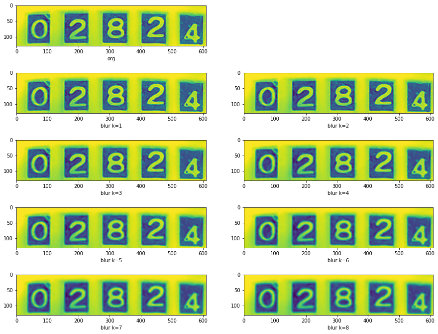

{"type":"mission","id":"2","description":"숫자 추출 프로그램", "temper":"good"}
## 숫자부분 전체 혹은 숫자 낱자를 추출해내는 프로그램 구성

계량기의 숫자인식에는 맥락이라는 것이 개입할 여지가 없으므로
여기서는 이미지로부터 개별 낱자를 추출하는 프로그램을 작성하여 숫자부분을 추출하고
개별 숫자별 화일을 생성한다.

다음 단계에서 화일명칭에 숫자값 레이블을 붙일것을 고려한다.


### 1. image smoothing
edge detection을 위한 전처리
```
def conv(img, n):
    kernel = np.ones((n,n),np.float32)/(n*n)
    return cv2.filter2D(img, -1, kernel)

for k in range(1,9):
    img5 = conv(img4,k)
    plt.imshow(img5)
```


Convolution의 Kernel size를 1 ~ 8까지 넣은 결과를 비교해본다.

이미지에 커널(마스크)를 컨볼루션하여 블러링(흐리게) 하는 처리를 통해 이미지의 노이즈를 제거하여 원하는 edge detection 을 얻어내기위한 과정이며, 
blurring 방법과 커널의 크기등 변수 원하는 결과를 얻기위한 최적을 값을 찾아낸다.

## 검색을 위한 키워드
opencv, edge detection, blur algorithm
