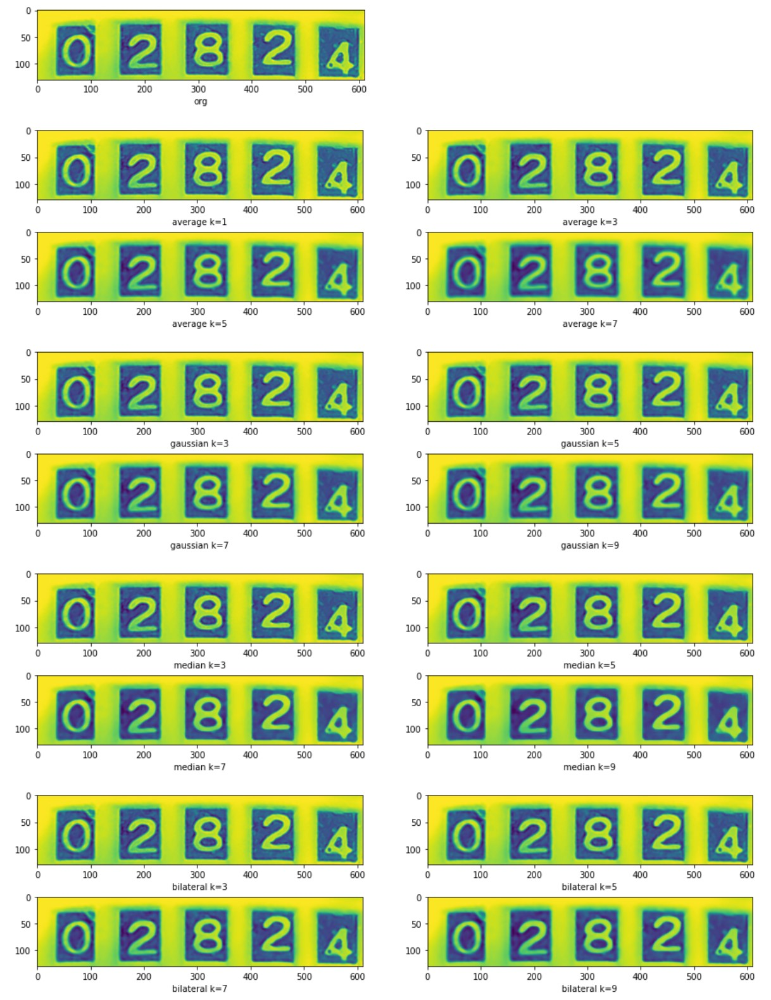
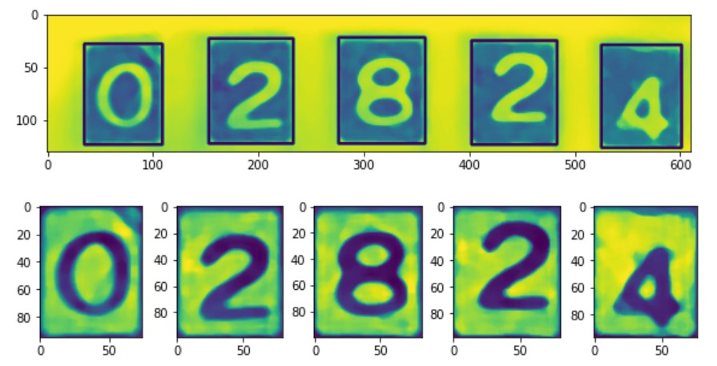

{"type":"mission","id":"2","description":"숫자 추출 프로그램", "temper":"good"}
## 숫자부분 전체 혹은 숫자 낱자를 추출해내는 프로그램 구성

계량기의 숫자인식에는 맥락이라는 것이 개입할 여지가 없으므로
여기서는 이미지로부터 개별 낱자를 추출하는 프로그램을 작성하여 숫자부분을 추출하고
개별 숫자별 화일을 생성한다.

다음 단계에서 화일명칭에 숫자값 레이블을 붙일것을 고려한다.


### 1. image smoothing
edge detection과 find contour의 정확도를 올리기위한 전처리과정으로써 이미지에서 원하지 않는 노이즈 부분을 제거하기위해 OpenCV에서 제공하는 다음 4가지의 blurring API와 Kernel size 최적의 파라미터를 찾아낸다.
```
    img5 = cv2.blur(img4,(k,k))
    img5 = cv2.GaussianBlur(img4,(k,k),0)
    img5 = cv2.medianBlur(img4,k)
    img5 = cv2.bilateralFilter(img4,k,75,75)
```



Convolution의 Kernel size에 (3,5,7,9)를 대입하여 얻은 이미치 처리 결과를 비교해본다.

이미지에 커널(마스크)를 컨볼루션하여 블러링(흐리게) 하는 처리를 통해 이미지의 노이즈를 제거하여 원하는 edge detection 을 얻어내기위한 과정이며, 
blurring 방법과 커널의 크기등 변수 원하는 결과를 얻기위한 최적을 값을 찾아낸다.

### 2. 글자의 bounding box 추출
글자가 검은색이 되도록 이미지를 반전시키고 적절한 임계값을 지정하고 글자를 둘러싸고 있는 사각형을 추출한다.
```
    rimg = ~img
    ret, thr = cv2.threshold(rimg, 60, 150, 0)
    contours,_ = cv2.findContours(thr, cv2.RETR_TREE, cv2.CHAIN_APPROX_SIMPLE)
```



각 낱글자를 둘러싸고 있는 직사각형의 이미지 부분을 추출한다.

## 검색을 위한 키워드
opencv, edge detection, blur algorithm
