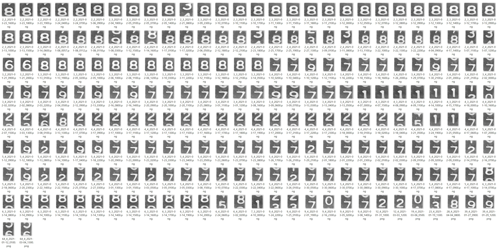

{"type":"mission","id":"3","description":"get number via calling google tesseract with image"}
## Reconize digit image by calling Google tesseract

### Google tesseract 활용 사례

```
n = pytesseract.image_to_string(img, config='--oem 3 --psm 10 -c tessedit_char_whitelist=0123456789')
plt.xlabel(n)
plt.imshow(rd)
```


인식된 값을 X축의 레이블로하여 그림으로 표현하였다.
282는 잘 인식되었으나, 0과 4는 인식되지 않았음을 알 수 있다.

04_build_training_dataset 미션 디렉토리에 다음과 같은 2개의 디렉토리가 있다.

  ./digits_image
  ./meter_image
  
./meter_image에 저장된 3082개의 계량이 이미지로부터 숫자를 5개씩 추출해서 낱글자로 위의 프로그램을 통해 얻은 문자인식 결과는 다음과 같다.

 * 계량기 이미지 3082개
 * 추출되어 사용된 낱글자 이미지 14,864개
 * 다음은 낱자별로 tesseract에서 empty string을 리턴한 케이스에 대한 추가분석 결과이다.
 
  글자 | 건수
  ----|----
  0 | 2802
  1 | 242
  2 | 33
  3 | 82
  4 | 90
  5 | 48
  6 | 92
  7 | 206
  8 | 284
  9 | 43
  경계선에 걸친 애매한 글자 | 330
  
  * 다음은 tesseract에서 인식은 하였으나 명백히 잘못 인식된 케이스이다. 226건이 발생하였다.
  
  
다음은 경계선에 걸친 애매한 숫자 이미지 예시이다.


다음은 tesseract가 잘못 인식한 이미지 예시이다.



본 과제에서 사용한 계량이 이미지 기준,
총 15410개의 낱글자에 대해 tesseract는 10942개에 대한 인식에 성공하였다.
tesseract가 인식하지 못한것으로 리턴된 글자는 4252개이고, 이중 3922개는 직접 레이블링을 하여 데이타로 사용하였다.
tesseract가 인식하였지만 틀린 결과를 준 글자는 226개이다.

종합적으로 tesseract는 71%의 인식율을 보여주었고, 이를 이용해서 71%는 자동으로 레이블링을 할 수 있었다.
