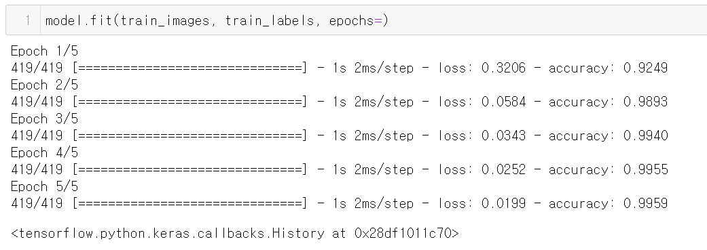

{"type":"mission","id":"6","description":"apply your dataset to MNIST"}

## 1. 머신러닝 모델 트레이닝 및 생성된 모델 저장 - apply_MNIST.ipynb

TensorFlow의 예제, Fashion MNIST 알고리듬을 그대로 사용하면서 데이타를 계량기의 숫자이미지로 바꾸어서 입력한 형태이다.
testdata에 대한 예측율이 99.59%로 우수하게 나옴을 알 수 있다.  training이 끝난 모델을 ./model 에 저장한다.

## 2. 저장된 모델을 읽어서 training및 test에 사용된 전체 digit에 대한 predict 검증 - verify_model.ipynb

./model 에 저장된 화일이 있음을 전제로 한다.

저장된 model을 읽어들여서 label이 되어있는 training 및 test data 전체에 대해 검증을 해본결과
총 14,864개의 낱글자에 대해 32개의 인식오류가 발생, 99.8%의 인식율을 보임을 알수있다.

인식오류가 발생한 글자들은 아래 링크에 정리되어있다.

https://github.com/ekyuho/Project-X/blob/main/Levels/003_meter_reading/05_apply_MNIST/wrong.pdf 

## 미리 만들어진 모델의 로딩

./model 의 내용이 비이었거나 veryfy_model.ipynb 의 실행에 오류가 있다면, 아래의 model을 다운로드 받으면 된다.

https://drive.google.com/file/d/1sa3dAdiMQzppiJV7o6Co9_fVoq1nucGW/view?usp=sharing