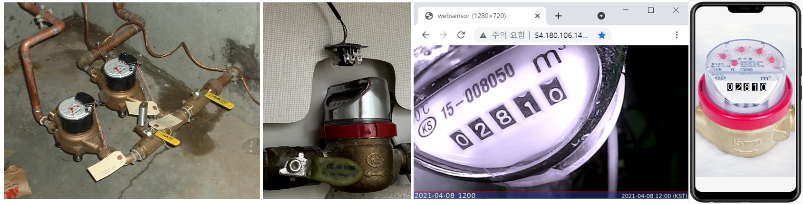

{"type":"level","id":"1","description":"수도계량기의 숫자 표시부를 읽어서 실시간 모니터링 하는 사물인터넷 스타트업을 위한 프로젝트","skill-required":"python","skill-acquired":["opencv","python web framework", "numpy ndarray"}

## 과제목표
수도 계량기 숫자 읽어서 웹서버에 실시간 디지탈트윈 기능, 실시간 분석 및 액튜에이션 확장기능 개발

## 배경
IoT 전문회사인 MeasureWare사의 기반서비스는 현장에 설치되어 사용중인 Legacy 계량기(통신기능등 부재)의 미터값을 실시간으로 읽어서 디지탈화하여 디지탈트윈 형태로 형상화 하는 것을 기반으로 실시간 감시, 실시간 액튜에이션, 리스크 관리 등 다양한 고객맞춤형 서비스를 제공하는 회사이다. 이 회사는 관리대상 미터에 카메라를 부착하여 HTTP를 통해 1시간 간격의 실시간 이미지를 가져오는 기능을 구현하였고 대상을 확대하고 있다.

* 수도계량기 이미지획득: http://bit.ly/websensor1
* 수도계량기 디지탈트윈: http://bit.ly/webmeter1

## 보유하고 있어야 할 badge (기술요소)
* Python

## 획득 Badge (기술요소)
* OpenCV
* Python Web Framework (Flask 혹은 django Web Framework)
* Tensorflow 패션 MNIST 수준의 머신러닝 프로그램
* Numpy array shape
* Numpy ndarray 
 
## List of Missions
* Mission 1: 모니터링 대상 계량기의 미터 이미지 획득단계 구현
  * 단독으로 작동하는 ESP32 Cam, Raspberry Pi에 USB웹캠을 연결하는 등 여러 옵션들에 대해 검토하고 최선의 방법을 찾는다. 
  * 혹은, http://bit.ly/websensor1 을 이용해서, 이미지 취득 부분을 스킵하고 먼저 머신러닝부터 시작하는 옵션을 고려한다.
  
* Mission 2: 대상 계량기의 숫자부분 이미지 추출
  * 숫자가 표시되는 계량기의 숫자표시부의 image로부터 인식하고자하는  숫자부분의 이미지를 추출한다.
  
* Mission 3: 문자인식을 위해 Google, Azure등의 API 사용
  * 무료 혹은 유료 API를 사용하여 숫자를 인식한다.
  
* Mission 4: 수도계량기 숫자인식 머신러닝을 위한 데이타 가공
  * 수도계량기 이미지화일을 다운로드 받기: https://drive.google.com/file/d/1EihUQdxjdJ6RfFpuV8ay4ZoeQ8_MLDJx/view?usp=sharing 

* Mission 5: 수도계량기 숫자인식 머신러닝 프로그램 만들기
  * 유사한 문제 해결을 위한 머신러닝 프로그램을 찾아 기반으로 삼는다.

* Mission 6: 인식된 수도계량기 값의 Delivery
  * 계량기 이미지에 인식된 숫자값을 overlay시켜서 표현하는 digital twin 웹미터기를 구현한다.
  * 사용자의 스마트폰에 push형태로 전달되는 alarm 기능을 구현한다.

* Mission 7: 플랫폼 형태로의 아키텍팅 
  * 실시간 감시, 실시간 자동제어 등의 기능확장에 용이한 아키텍처를 구성한다.

## 참고할 만한 자료 검색을 위한 키워드
python, ESP32 cam, web cam night vision, mnist, fashion mnist, opencv, numpy shape, numpy ndarray, slack web hookup, python flask, python django
