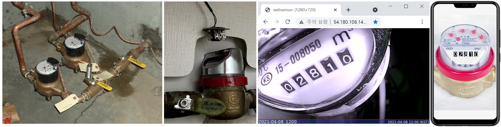

{"type":"level","id":"1","description":"수도계량기의 숫자 표시부를 읽어서 실시간 모니터링 하는 사물인터넷 스타트업을 위한 프로젝트","skill-required":"python","skill-acquired":["opencv","python web framework", "numpy ndarray"}

## 과제목표
IoT 전문회사인 MeasureWare사의 기반서비스는 현장에 설치되어 사용중인 Legacy 계량기(통신기능등 부재)의 미터값을 실시간으로 읽어서 디지탈화하여 디지탈트윈 형태로 형상화 하는 것을 포함, 실시간 감시, 실시간 액튜에이션, 리스크 관리 등 다양한 고객맞춤형 서비스를 제공하는 회사이다. 이 회사의 기술인력 채용공고이며, 아래 리스팅된 기술역량의 한가지 사례를 본 과제를 통해 확보할 수 있다.

* github 사용에 능하고 open source 활용가능
* 파이썬 중급이상 (TensorFlow 유경험)
* OpenCV등 이미지를 처리 경험
* Fashion MNIST에 준하는 이미지 classification 개발가능
* 머신러닝을 이용하여 다양한 아날로그 계량기의 숫자를 인식하는 종합 머신러닝 시스템을 개발할 수 있는 기술역량 보유
* node.js, Python 기반 Web 서버활용 및 클라우드기반 응용시스템 아키텍처 구성 및 개발 가능

## 배경
머신러닝(인공지능)은 축적된 데이타의 분석으로부터 시작되기때문에 풀고자 하는 대상으로부터 관측된 디지탈화된 원천데이타가 필요하다. 
첨단 원격검침 기능을 가진 첨단 계량기들이 있지만, 이미 현실세계에는 수많은 아날로그 계량기들이 설치되어있어서 필요시 사람이 현장에서 상태를 알 수 있도로 한다. 
대부분의 아날로그 계량기들이 필요시 확인만 하면 되는 목적이겠지만, 어떤 계량기들은 단위시간당 변화량을 계속 점검할 필요가 있거나,
현장의 여러 목적으로 설치된 계량기들의 값을 종합적으로 보고 상태를 진단할 목적,
혹은 사람이 직접 해당 장소를 방문하여 주기적으로 현장의 계량기 미터값을 기록하기 어려운 문제 등
여러 이유와 요구에 따라 바늘형, 혹은 숫자형 레거니 아날로그 계량기의 값을 머신러닝 기법을 이용하여
자동으로 인식하여 수집하는 시스템이 기술적가치, 사업적 가치를 가질 수 있다.

시스템은 크게 3부분으로 구성된다. 기존의 아날로그 계량기 어떤 것이든 해당이 되지만,
여기서는 우리 주변에서 흔히 찾아볼 수 있는 '수도계량기'를 대상으로 한다. 수도계량기는 수도 사용량 측정용이지만
오래된 아파트의 적산열량계에도 사용되어 소정의 계산규칙을 적용하여 '사용열량' 으로 환산해서 사용할 수도 있다.

### 1. 계량기 표시부 이미지 획득부
우리 주변에서 흔히 볼 수 있는 물흐름을 계량하는 수도계량기의 숫자 표시부 앞에 Night Vision이 가능한 카메라 기구를 설치하여
낮밤 구분없이 일정주기로 미터의 이미지를 획득하고 이를 웹주소를 통해 가져갈 수 있도록 구성한다.

이부분이 또다른 기술요소를 포함하는 작업이고, 대상의 선정, 카메라의 설치등 머신러닝과는 다른 많은 작업들이 수반되는 것이라
'사업화'를 위해서는 가장 중요한 대목이 되는 부분이지만, 여기서는 단순히 아래의 링크를 활용해도 2단계 작업이 가능하다.

* 수도계량기 이미지획득 URL: http://bit.ly/websensor1 

이는 1시간 주기 실시간 어떤 개인거주 아파트의 열량측정용 수도계량기의 이미지이다.

### 2. 머신러닝 계량기 숫자인식부

OpenCV의 여러 기능들을 활요하여 계량기의 이미지를 추출한다. 
먼저, 이미지를 수평으로 맞추기위해 회전시키고, 사다리꼴 형태로 왜곡된 이미지를 지사각형 형태로 맞추는 작업,
edge detection 관련한 여러 기술들이 사용하여 계량기의 메터값 부분을 추출한다.

숫자부분 이미지 추출을 위해, 이미지의 경계 추출을 위한 bluring 기법, thresh hold값의 선택 등 이미지의 특성에 맞는 최적의 parameter를 찾아내는 반복적 실험이 필요하다.
최종적으로 숫자 낱자를 추출하여 화일로 저장시키고 화일명에 레이블을 붙이는 과정을 통해 dataset을 만든다.

머신러닝 알고리듬은 TensorFlow의 Fashion MNIST 알고리듬에서 image 데이타만을 교체하는 방식이므로,
기반기술에 대해서 미리 TensorFlow 사이트의 Fashion MNIST (초급 첫번째 신경망)를 학습한다.

* TensorFlow Fashion MNIST URL: https://www.tensorflow.org/tutorials/keras/classification  

추가로, 간단히 google tesseract API를 통한 문자인식 방법도 사용한다.

이상의 과정을 통해 계량기의 숫자값을 인식했으면, 다른 huristic을 적용하여 인식된 숫자값의 적절성에 대한
검증 규칙을 적용한다. 수도계량기의 예는 다음과 같다.

  * 숫자는 1씩 일정하게 증가한다.
  * 숫자가 증가하는 대략의 주기가 있다.

### 3. 머신러닝 응용시스템부

인식된 값이 검증이 끝나고나 다음에는 이를 활용하는 시스템을 구동하게된다. 본 과제에서는
1차적으로 웹화면에 미터의 이미지를 배경으로 인식된 숫자를 오버랩시켜서 표시하는 
"디지탈 트윈 미터"를 보이는 것을 개발한다. 아래에 구현 결과 예시 링크이다.

* 수도계량기 디지탈트윈: http://bit.ly/webmeter1

디지탈트윈 수도계량기로 기초적 응용사례를 예시했지만, 사업적 가치가 있는 응용 유즈케이스를 예시하면 다음과 같다.

  * 비정상적 메터 증가분 모니터링 및 알람시스템
  * 비정상 유량 흐름발생 탐지 및 알람시스템
  * 단위시간별, 계절별, 시간대별, 유량 사용 패턴 분석
  * 실시간 사용량 표시 (스마트 수도계량기를 통한 물사용 절약관련한 article - https://www.geospatialworld.net/blogs/how-iot-enabled-smart-water-meters-helps-in-water-conservation/ )

## 본 과제를 위해 보유하고 있어야 할 기술요소
* Python, Numpy Array의 shape에 대한 이해
* 오픈소스를 다운로드 받고 실행하는데 부담을 느끼지 않는 수준의 소프트웨어 개발 경험
* "완벽히 이해하지" 못하는 소프트웨어 시스템을 필요한 만큼 이해하고 다룰 수 있는 엔지니어링 센스

## 획득 기술요소
* 여러 방법이 있겠지만, 보편적으로 사용되는 OpenCV의 기능과  API에 대한 이해와 사용경험
  * image cropping, persepecitive변경, image distortion처리, edge detection을 위한 blurring 등 기법들
* Python Web Framework (Flask 혹은 django Web Framework)
* Numpy array다루기: shape, reshape
* 머신러닝의 training dataset을 구성하는 방법 - Numpy ndarray 
* Tensorflow 패션 MNIST 수준의 머신러닝 프로그램
* data의 생성부터 데이타의 전처리, 레이블링, 머신러닝 분석, 검증로직구성, 값의 활용 까지의 from A to Z의 전체 사이클 경험
 
## List of Missions
* Mission 1: 모니터링 대상 계량기의 미터 이미지 획득단계 구현
  * 단독으로 작동하는 ESP32 Cam, Raspberry Pi에 USB웹캠을 연결하는 등 여러 옵션들에 대해 검토하고 최선의 방법을 찾는다. 
  * 혹은, http://bit.ly/websensor1 을 이용해서, 이미지 취득 부분을 스킵하고 먼저 머신러닝부터 시작하는 옵션을 고려한다.
  
* Mission 2: 대상 계량기의 숫자부분 이미지 추출
  * 숫자가 표시되는 계량기의 숫자표시부의 image로부터 인식하고자하는  숫자부분의 이미지를 추출한다.
  
* Mission 3: 문자인식을 위해 Google, Azure등의 API 사용
  * 무료 혹은 유료 API를 사용하여 숫자를 인식한다.
  
* Mission 4: 수도계량기 숫자인식 머신러닝을 위한 데이타 가공
  * 수도계량기 이미지화일을 다운로드 받기: https://drive.google.com/file/d/1EihUQdxjdJ6RfFpuV8ay4ZoeQ8_MLDJx/view?usp=sharing 

* Mission 5: 수도계량기 숫자인식 머신러닝 프로그램 만들기
  * 유사한 문제 해결을 위한 머신러닝 프로그램을 찾아 기반으로 삼는다.

* Mission 6: 인식된 수도계량기 값의 Delivery
  * 계량기 이미지에 인식된 숫자값을 overlay시켜서 표현하는 digital twin 웹미터기를 구현한다.
  * 사용자의 스마트폰에 push형태로 전달되는 alarm 기능을 구현한다.

* Mission 7: 플랫폼 형태로의 아키텍팅 
  * 실시간 감시, 실시간 자동제어 등의 기능확장에 용이한 아키텍처를 구성한다.

## 참고할 만한 자료 검색을 위한 키워드
python, ESP32 cam, web cam night vision, mnist, fashion mnist, opencv, numpy shape, numpy ndarray, slack web hookup, python flask, python django
